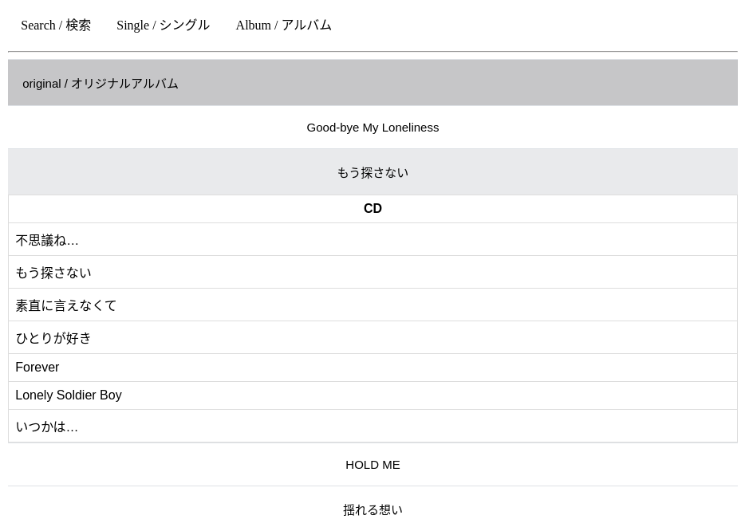
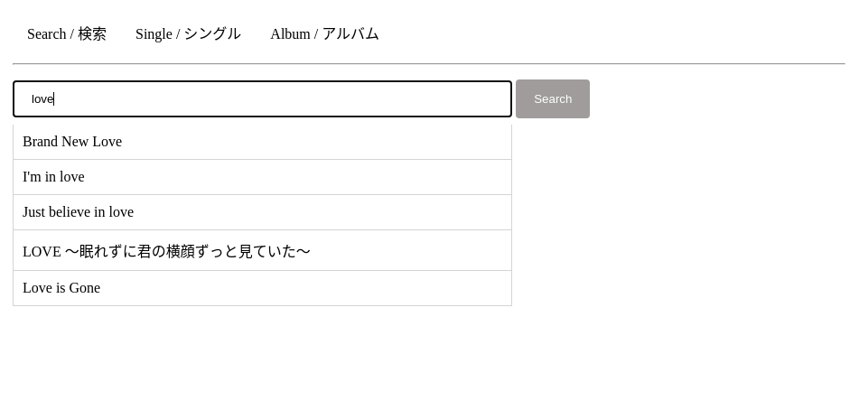
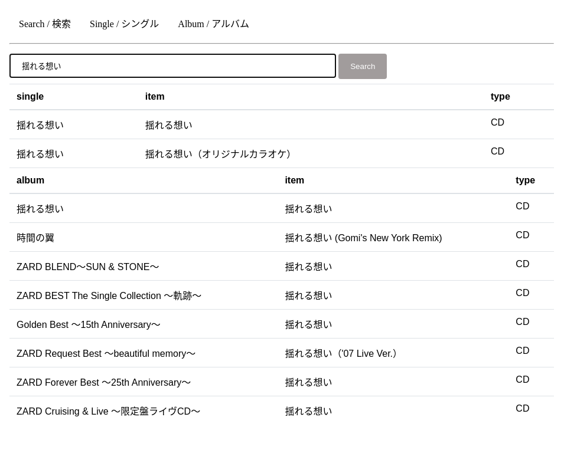

# ZARD-songs

This repository contains all the data of ZARD's singles and albums in the JSON format which are collected from [Wikipedia](https://ja.wikipedia.org/wiki/ZARD).

* You can check this [website](https://brucejian43.github.io/ZARD-songs/) for exploration.

* You can also use this website to find which single or album containing the song you want to search like the image below.

## Copyright

The data in this repository is merely from Wikipedia, and all the information about ZARD's song is copyrighted by © B-Gram.

You can go to [ZARD's offical website](https://wezard.net/) for the lately news.
